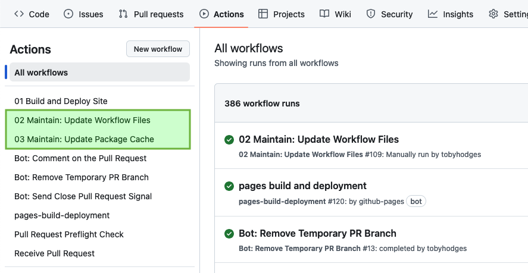
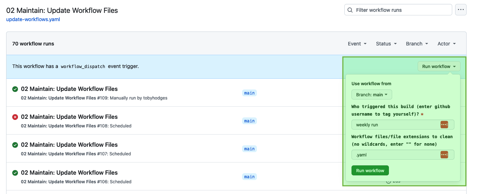

# Maintainers Handbook

## About This Handbook 

The Maintainers Handbook is designed to support members of The
Carpentries community who are serving as a Lesson Maintainer. It is maintained by The Carpentries Curriculum Team.  If you believe anything needs to be added or updated here, or if you would like to provide feedback on the content, please email the {{'[Curriculum Team](mailto:{})'.format(curriculum_email)}} or open an issue on the {{'[source repository of this handbook]({})'.format(gh_repo)}}. If you are unfamiliar with any of the terms used in this handbook, please refer to our {{'[Glossary of terms]({})'.format(glossary)}}.

## Introduction

The Carpentries Maintainers work with the community to ensure
lessons stay up-to-date, accurate, functional and cohesive. Maintainers
monitor their lesson repository, ensure that pull requests and issues
are addressed on time, and participate in the lesson
development cycle including lesson releases. They endeavour to be
welcoming and supportive of contributions from all members of the
community. This community of practice is a great place to learn to
collaborate effectively in Git and GitHub.

## Roles and Responsibilities

The Carpentries teaches 400–600 workshops each year, meaning our lesson
materials are being used practically every day for synchronous, guided
learning. Making sure our lessons keep working without interruptions is
therefore our number one goal for maintenance.

A secondary (but still extremely important!) goal is ensuring that the
spaces we use for lesson development and maintenance are just as
welcoming and inclusive as our workshops.

Ensuring that our lessons are on the cutting edge of new technology and
tooling is *not* a priority for The Carpentries. Although we do want our
materials to stay relevant, it is far more important that our lessons
remain pedagogically sound and technically viable, than that they
represent the latest and greatest new developments in the field.

With these goals in mind, The Carpentries' expectations of Maintainers
are to:

-  Monitor the lesson repository and make sure that pull requests (PRs) and Issues are responded to promptly (even if that response is “sorry, this is out of scope”).
-  Not introduce new errors into the lesson.
-  Quickly fix anything that is unambiguously an error or that    negatively affects workshop learners.
-  Be receptive and welcoming to suggestions for improving the lessons.
-  Evaluate all contributions given The Carpentries pedagogical model:
   -  Teach what is most relevant and useful for learners.
   -  Avoid unnecessary jargon and detailed explanations. Always ask
      yourself whether it is necessary for the learner.
   -  Keep language motivating.
   -  Meet learners where they are.
   -  Emphasise the importance of continued learning and improvement.

Maintainers are responsible for:

-  Routinely:
   -  Ensuring reasonable response time to all submitted Issues and PRs. At a minimum, ensuring all Issues and PRs are acknowledged within two days.
   -  Quickly addressing issues and PRs tagged as “bug”s.
   -  Submitting Issues as they arise.
   -  Adhering to the Code of Conduct and alerting the Code of Conduct Committee to any potential violations.
   -  Identifying potential new Maintainers based on their review   activity.

-  Periodically:
   -  Helping prepare lessons for publication.
   -  Bringing in updates to the lesson template.

Maintainers represent The Carpentries community and should strive to
embody The Carpentries philosophy, by:

-  Recognising the importance of communication and being welcoming to
   all contributors.
-  Giving feedback to contributors using The Carpentries model:

   -  Find what’s good. Be specific about improvements needed. Use
      motivational language.

-  Evaluating lesson contributions in light of Carpentries pedagogical model:

   -  Teach what’s most relevant and useful for learners.
   -  Avoid getting bogged down in technical details.
   -  Keep language motivating.
   -  Emphasise the importance of continued learning and improvement.

## Onboarding

New Maintainers go through an onboarding process, led by a member of The Carpentries Curriculum Team and the Maintainer Community Lead. Maintainer Onboarding takes place at least once per year. New rounds of onboarding will be announced on The Carpentries blog and main
communications channels (discuss@ on TopicBox, #general Slack channel).

The curriculum for onboarding new Maintainers is available as a {{'[Maintainer Onboarding Lesson]({})'.format(maintainer_onboarding)}}.

## Offboarding

A yearly email with a one-question survey will be sent to Maintainers in
mid-to-late January. If the Maintainer responds “yes” to this survey,
they will remain a Maintainer for the next year. If a Maintainer replies
“no” or does not respond within a month of receiving the survey, they
will become an alumnus Maintainer and their permissions to their
repository will be revoked. Active Maintainer status can be restored at
any time by contacting the Maintainer Community Lead. 

[The proposal for yearly Maintainer check-ins](https://github.com/carpentries/maintainer-RFCs/issues/19) has
more detailed information. If a Maintainer would like to step away from
the role outside this schedule, they should inform the Maintainer
Community Lead and the other Maintainers on their lesson(s).

## Communication and Collaboration Spaces

### Slack

{{'[Join The Carpentries Slack workspace]({})'.format(slack_invite)}}. To follow conversations relevant to this role, you should join the following channels:

-  {{'[The invite-only #maintainers channel]({}/archives/C8H5LN44V)'.format(slack)}} on The Carpentries Slack workspace is a platform for the whole community to ask questions and engage in discussions around the subject of lesson maintenance. If you are a Maintainer and do not already have access to this channel, please contact the Maintainer Community Lead.
-  We recommend that Lesson Maintainers browse existing channels in the Slack workspace, for any that are relevant to the topic/domain of their lesson.
-  It can also be helpful to create a new channel for your lesson, as a space for you to discuss the development process with collaborators, and for community members to ask questions about the lesson.

If you are new to Slack, please check out our {{"[Slack Guide]({})".format(slack_guide)}}.

### Community Calendar

Once scheduled, all Maintainer Community Calls are listed on our
{{'[Community Calendar]({}/community/events/)'.format(carpentries_website)}}. You can add relevant events to your calendar from there by clicking on the event you would like to attend.

### Collaborative Notes

The Carpentries uses {{"[Etherpad]({}/resources/communications/etherpads)".format(handbook_url)}} as a collaborative note-taking tool during workshops, training, and other Carpentries-related events.  Below is a list of Etherpads relevant to serving as a Lesson Maintainer.

- {{'[Pad-of-pads]({}/pad-of-pads)'.format(etherpad)}}: A list of
   our most commonly used Etherpads and other resources.
- {{'[Maintainer Community Call Notes]({}/maintainers)'.format(codimd)}}: Signup information, connection details, and notes taken from monthly   coworking sessions (CodiMD).

### GitHub

-  [Maintainer Resources](https://github.com/carpentries/maintainer-resources):  a place to record minutes from the Maintainer Community Calls and helpful tips on flight rules.
-  [Maintainer Requests for Comments (RFCs)](https://github.com/carpentries/maintainer-RFCs) Requests for comment for technology changes and other issues affecting lesson Maintainers.

### TopicBox

You can access The Carpentries mailing lists from
{{'[Topicbox]({}/latest)'.format(topicbox)}}. Below is a list
of those relevant to the activities and programs covered by this
handbook.

- {{'[The Maintainers mailing list]({}/groups/maintainers)'.format(topicbox)}} is used for announcements relevant to Lesson Maintainers.

To join one or more Carpentries mailing lists, you will need to {{'[create a login]({}/latest)'.format(topicbox)}}. Once
you have done this, you can scroll through the list of groups and click
“Join the Conversation” (for open mailing) or “Request to Join” (for
those mailing lists requiring administrator approval).  If you are new to Topicbox, please check out our {{"[Topicbox Guide]({})".format(topicbox_guide)}}.

## Step-by-Step Guides

### Keeping the Lesson Infrastructure Up-to-date on Your Repository
New versions of the lesson infrastructure are released periodically, to fix bugs and introduce new features. 
All of The Carpentries lesson repositories are configured to receive automated pull requests soon after release. 
These pull requests will be opened by the `carpentries-bot` account, with a title similar to “Workflows to Version x.y.z”. 
To ensure that your lesson site builds with the latest version of the Workbench, please merge these pull requests as soon as possible after they have been opened.
Lessons based on R Markdown source files will also receive pull requests from the `carpentries-bot` account to update the versions of the R packages used in the lesson, titled “Update NN packages” where NN is the number of packages. 
Similarly to the workflow updates, these pull requests should be merged quickly to ensure that the lesson builds correctly.

The GitHub Actions workflows that create these pull requests are configured to run once per week. 
Sometimes you might want to trigger the process before the next scheduled run, e.g. if the new version of the workflows or packages will fix a problem that is preventing your lesson from building. 
To trigger these workflows manually, visit the Actions tab of your repository and select the workflow from the list on the left of the screen: both workflows include ‘Maintain’ in their name.

After selecting the workflow you want to run, select ‘run workflow’ near the top right corner of the history of workflow runs. You can leave the default values in the small dropdown menu unchanged, and select ‘Run Workflow’ again.

If this process does not work, or you receive error messages from the workflow and it fails to complete, contact the [Curriculum Team](mailto:curriculum@carpentries.org) and/or ask for help in the {{'[workbench channel on Slack]({}/archives/C03DEQ5T2DA)'.format(slack)}}.

### Using Issue Labels to Promote Collaboration

GitHub allows the Maintainers of a repository to add contextual
information to Issues and Pull Requests in the form of labels. Two
labels, used by The Carpentries and in many repositories across GitHub,
can be deployed to increase the visibility of your lesson and encourage
community members to contribute to its development.

The **“help wanted”** label should be used to highlight issues with
which you would welcome additional help. The Carpentries website
includes {{'[a Help Wanted page]({}/lessons/help_wanted)'.format(carpentries_website)}}, which can
automatically list every issue labelled “help wanted” on repositories
from The Carpentries, Software Carpentry, Data Carpentry, Library
Carpentry, CarpentriesLab, and The Carpentries Incubator. Find out how
to include issues from your lesson repository on the Help Wanted page by
reading the  {{'[information for Maintainers]({}/lessons/help_wanted#information-for-maintainers)'.format(carpentries_website)}}
on the page itself.

The **“good first issue”** label should be used to identify issues that
would make a good entry point for newcomers searching for a way to
contribute to your lesson. The work needed to close an issue with this
label would typically not require an extensive knowledge of the
structure or intricacies of your lesson repository, or an expert
understanding of the content. The “good first issue” label is used so
extensively that GitHub provides a page at `[repository
URL]/contribute` (example: <https://github.com/swcarpentry/r-novice-gapminder/contribute>) for every repository, listing issues with this label.

### Informing Community Members about a Period of Absence

If you plan to temporarily step away from the role of Maintainer,
e.g. parental leave, exam season, etc, it can be helpful to your fellow
lesson Maintainers and potential contributors to let them know. Here are
some steps you can take to notify the community about your temporary
absence/unavailability:

1. Set a status and mark yourself as “busy” on GitHub:

   1. Log into GitHub.com
   2. Click on your profile picture at the top-right of the window
   3. Select “Set status”
   4. In the “What’s happening?” box, write a short statement that lets
      other users know you are unavailable. You don’t have to tell
      people why - your status could be “temporarily unavailable” or
      “unavailable until DATE” to tell people when they can expect to
      find you back on GitHub. You can choose an emoji to accompany your
      status by clicking on the face icon next to the status message
      input.
   5. Check the “Busy” box, so that other users will receive a
      notification from GitHub about your status when they mention you
      in issues and pull requests, assign you to an issue, or request a
      review from you.
   6. {{"[**You can also set a status on Slack**]({})".format(slack_guide)}}. The process is very similar to GitHub’s, i.e. you should log in, click on your profile picture at the top-right of the window, and select “Update your status”. That will open a pop-up where you can write a status message.

2. Inform your co-Maintainers:

   7. Send them an email or a direct message on Slack.
   8. If you need help finding contact information for any of your
      fellow Maintainers, contact the Maintainer Community Lead.

### What to Do If Other Maintainers Do Not Respond
Sometimes, a Maintainer may want a second opinion from their fellow Maintainers before merging a pull request (or might want somebody else to review their own changes). 
The table below describes the steps we recommend that you take if you have tagged your co-Maintainers and waited for a short while, e.g. one or two weeks, but not received any response.

* What is urgent? In general, you can consider the change urgent if the current version of the relevant content in the lesson is incorrect or broken in some way. 
  Urgent changes might be time-sensitive (e.g. a language feature is being deprecated) or would provide a significant improvement to the accessibiility of the lesson content (e.g. adding of improving alternative text on an image). 
* What is complex? Here, we refer to changes as complex if they contain anything that you could reasonably expect somebody to disagree with or want to word differently.
  Non-complex changes might be typo fixes, updates to the output of an example code block, or a new version of a screenshot used in the lesson.

## Resources

### [Maintainer Onboarding Curriculum](https://carpentries.github.io/maintainer-onboarding/)

The curriculum used at Maintainer Onboarding. This resource can be a
helpful reference for Maintainers after they have completed onboarding. It includes [tips for managing issues on a repository](https://carpentries.github.io/maintainer-onboarding/02-communicate-contributors#top-ten-tips-for-managing-issues-and-prs), guidance for [tagging the Curriculum Team on issues and pull requests](https://carpentries.github.io/maintainer-onboarding/03-communicate-maintainers.html#github), and plenty of other useful information you might want to return to after onboarding.

### [Introduction to The Carpentries Workbench](https://carpentries.github.io/sandpaper-docs/)

Documentation for The Carpentries Workbench, open source infrastructure
for lesson websites. The documentation explains how to install the
Workbench so that Lesson Maintainers can edit and preview their lessons
on their computer, how to initialise a new lesson and use the
various elements of the lesson template, and how to keep up to date with
the latest changes to the infrastructure.

### {{'[Curriculum Advisory Committee Consultation Rubric]({}/handbooks/curriculum_advisors.html#curriculum-advisory-committee-consultation-rubric)'.format(handbook_url)}}

This rubric defines the division of responsibilities between The
Carpentries Maintainers and The Carpentries Curriculum Advisory
Committees (CACs). It can be used by Maintainers to help determine
whether to notify or ask the relevant CAC about a proposed change to
their lesson.

### {{'[Lesson Sprint Recommendations]({}/resources/curriculum/lesson-sprint-recommendations.html)'.format(handbook_url)}}

A collection of recommendations for community members who want to organise events dedicated to the development and improvement of a lesson. Includes lists of things to consider doing before, during, and after a development sprint, and tools and other resources to support its success.

### {{'[Lesson Release Process]({}/resources/curriculum/lesson-release.html)'.format(handbook_url)}}

### [Lesson Developer Handbook](/handbooks/lesson_developers.md)

The handbook for community members developing new lessons includes information, guidance, and further resources that may also be interesting to Mainatiners.

### [Collaborative Lesson Development Training Curriculum](https://carpentries.github.io/lesson-development-training/)

A lesson designed to teach skills and good practices in lesson design,
lesson website development, and collaboration via GitHub. Community
members can apply to join this training, and/or follow the curriculum in
their own time.

