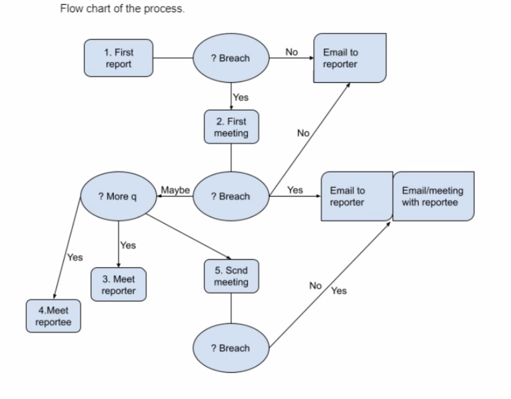

# The Carpentries Code of Conduct

## Code of Conduct (Summary View)

Below is a summary of The Carpentries Code of Conduct. Continue reading for a [more detailed description of the CoC](#code-of-conduct-detailed-view).

For more information please review our:
- [Incident Response Guidelines](incident-response.md)
- [Incident Reporting Guidelines](incident-reporting.md)
- [Incident Response Procedure](enforcement-guidelines.md)
- [Termed Suspension Guidelines](termed-suspension.md)

We are dedicated to providing a welcoming and supportive environment for all people, regardless of background or identity. By participating in this community, participants accept to abide by The Carpentries' Code of Conduct and accept the procedures by which any Code of Conduct incidents are resolved. Any form of behaviour to exclude, intimidate, or cause discomfort is a violation of the Code of Conduct. In order to foster a positive and professional learning environment we encourage the following kinds of behaviours in all platforms and events:

* Use welcoming and inclusive language
* Be respectful of different viewpoints and experiences
* Gracefully accept constructive criticism
* Focus on what is best for the community
* Show courtesy and respect towards other community members

If you believe someone is violating the Code of Conduct, we ask that you report it to The Carpentries Code of Conduct Committee by [completing this form][reporting-form], who will take the appropriate action to address the situation.

## Code of Conduct (Detailed View)

### Part 1. Introduction 

The Carpentries is a community-led project. We value the involvement of everyone in the community. We are committed to creating a friendly and respectful place for learning, teaching and contributing. All participants in our events and communications are expected to show respect and courtesy to others.

To make clear what is expected, everyone participating in The Carpentries activities is required to conform to the Code of Conduct. This Code of Conduct applies to all spaces managed by The Carpentries including, but not limited to, workshops, email lists, and online forums such as GitHub, Slack and social media (e.g., LinkedIn, Bluesky, Mastodon). Workshop hosts are expected to assist with the enforcement of the Code of Conduct.  

The Carpentries [Code of Conduct Committee](https://carpentries.org/coc-ctte/) is responsible for enforcing the Code of Conduct. It can be contacted by emailing [coc@carpentries.org](mailto:coc@carpentries.org). 
All reports will be reviewed by the Code of Conduct Committee and will be kept confidential. 
 
### Part 2. The Carpentries Code of Conduct

The Carpentries is dedicated to providing a welcoming and supportive environment for all people, regardless of background or identity. As such, we do not tolerate behaviour that is disrespectful to our teachers or learners or that excludes, intimidates, or causes discomfort to others. We do not tolerate discrimination or harassment based on characteristics that include, but are not limited to, gender identity and expression, sexual orientation, disability, physical appearance, body size, citizenship, nationality, ethnic or social origin, pregnancy, familial status, veteran status, genetic information, religion or belief (or lack thereof), membership of a national minority, property, age, education, socio-economic status, technical choices, and experience level. 

Everyone who participates in Carpentries activities is required to conform to this Code of Conduct. It applies to all spaces managed by The Carpentries including, but not limited to, workshops, email lists, and online forums such as GitHub, Slack and social media (e.g., LinkedIn, Bluesky, Mastodon). Workshop hosts are expected to assist with the enforcement of the Code of Conduct. By participating, participants indicate their acceptance of the procedures by which The Carpentries resolves any Code of Conduct incidents, which may include storage and processing of their personal information. 

#### Part 2.1 Expected behaviour

All participants in our events and communications are expected to show respect and courtesy to others. All interactions should be professional regardless of platform: either online or in-person. In order to foster a positive and professional learning environment we encourage the following kinds of behaviours in all Carpentries events and platforms:

* Use welcoming and inclusive language
* Be respectful of different viewpoints and experiences
* Gracefully accept constructive criticism
* Focus on what is best for the community
* Show courtesy and respect towards other community members

Note: See the [four social rules](https://www.recurse.com/manual#sub-sec-social-rules) for further recommendations.

#### Part 2.2 Unacceptable behaviour

Examples of unacceptable behaviour by participants at any Carpentries event/platform include:

- written or verbal comments which have the effect of excluding people on the basis of membership of any specific group  
- causing someone to fear for their safety, such as through stalking, following, or intimidation  
- violent threats or language directed against another person
- the display of sexual or violent images  
- unwelcome sexual attention  
- nonconsensual or unwelcome physical contact  
- sustained disruption of talks, events or communications
- insults or put downs  
- sexist, racist, homophobic, transphobic, ableist, or exclusionary jokes
- excessive swearing
- incitement to violence, suicide, or self-harm  
- continuing to initiate interaction (including photography or recording) with someone after being asked to stop  
- publication of private communication without consent  

#### Part 2.3 Consequences of Unacceptable behaviour

Participants who are asked to stop any inappropriate behaviour are expected to comply immediately. This applies to any Carpentries events and platforms, either online or in-person. If a participant engages in behaviour that violates this code of conduct, the organisers may warn the offender, ask them to leave the event or platform (without refund), or engage The Carpentries Code of Conduct Committee to investigate the Code of Conduct violation and impose appropriate sanctions.

## Process Flow Diagram

The diagram below illustrates the following steps in following a Code of Conduct report.

* First report -> assess if there is a CoC report and clear breach
    * No report or breach -> respond with an explanation to the reporter
    * Breach identified -> set up a first meeting with the CoCc (Read about Incident Response Group in CoCc Governance) to collectively identify specific issues and breaches
* If a specific breach/issue was not identified -> reply to the reporter
* If a specific breach/issue was identified -> email the reporter/reportee as explained in CoC report handling and enforcement process
* If it was undecided that a breach/issue occurred -> hold a meeting with the reporter/reportee as explained in CoC report handling and enforcement process -> Hold a second meeting with the CoCc to identify consequence/next steps as explained in CoC report handling and enforcement process

## Update Logs

- 2023-01-11 Added the process flow diagram as provided by [Malvika Sharan in this issue](https://github.com/carpentries/docs.carpentries.org/issues/619)

- 2020-09-23 The CoCc Governance document was added to the handbook. This document is approved by the members of the Code of Conduct committee, the executive director, Kari L. Jordan and executive committee. Contributors: drafted by Karin Lagesen, Malvika Sharan and Karen Cranston (2019) and extensively reviewed and updated by the committee members of the Code of Conduct committee: Karin Lagesen, Malvika Sharan, Karen Cranston, Samatha Ahern, Ivo Arrey, Benjamin Schwessinger, François Michonneau and Konrad Förstner (2019-2020).

- 2019-07-17 The CoCc membership agreement document was added to the handbook. This document is approved by the members of the Code of Conduct committee, the executive director, Tracy Teal and trainers community. Contributors: drafted by Malvika Sharan (January 2019) and intensively reviewed and updated by the committee members Malvika Sharan, Karin Lagesen, Kari L. Jordan, Samantha Ahern, and Simon Waldman (February-April 2019).

- 2019-02-28 Added appeal process, procedure for following up with a reportee, terminology, CoC incident response procedure, termed suspension checklist, and expanded clauses for conflicts of interest. Contributors: Ethan White, Kari L. Jordan, Karin Lagesen, Malvika Sharan, Samantha Ahern, and Simon Waldman.

- 2018-09-11 Code of Conduct revised to provide straightforward examples of both beneficial and unwanted behaviour. Also includes changes regarding evaluating intent. Contributors: Ethan White, Kari L. Jordan, Karin Lagesen, Malvika Sharan, Samantha Ahern, and Simon Waldman.

- 2018-09-11 Reporting guidelines revised to include alternate contact points. Contributors: Ethan White, Kari L. Jordan, Karin Lagesen, Malvika Sharan, Samantha Ahern, and Simon Waldman.

- 2016-11-21 Code of Conduct, Reporting Guidelines and Enforcement Manual released. Documents were adapted from guidelines written by the [Django Project](https://www.djangoproject.com/conduct/enforcement-manual/), which was itself based on the [Ada Initiative](http://geekfeminism.wikia.com/wiki/Conference_anti-harassment/Responding_to_reports) template and the [PyCon 2013 Procedure for Handling Harassment Incidents](https://us.pycon.org/2013/about/code-of-conduct/harassment-incidents/). Contributors: Adam Obeng, Aleksandra Pawlik, Bill Mills, Carol Willing, Erin Becker, Hilmar Lapp, Kara Woo, Karin Lagesen, Pauline Barmby, Sheila Miguez, Simon Waldman, Tracy Teal. 

## About this Document

This document is adapted from guidelines written by the [Django Project](https://www.djangoproject.com/conduct/enforcement-manual/), which was itself based on the [Ada Initiative](http://geekfeminism.wikia.com/wiki/Conference_anti-harassment/Responding_to_reports) template and the [PyCon 2013 Procedure for Handling Harassment Incidents](https://us.pycon.org/2013/about/code-of-conduct/harassment-incidents/). Contributors to the the initial document are Adam Obeng, Aleksandra Pawlik, Bill Mills, Carol Willing, Erin Becker, Hilmar Lapp, Kara Woo, Karin Lagesen, Pauline Barmby, Sheila Miguez, Simon Waldman, and Tracy Teal. Additional language was added by [Otter Tech](https://otter.technology) from the [PyCon U.S. 2018 Code of Conduct](https://us.pycon.org/2018/about/code-of-conduct/) ([licensed CC BY 3.0](http://creativecommons.org/licenses/by/3.0/))
In 2018, the Code of Conduct was revised to add a summary, straightforward examples of both beneficial and unwanted behaviors, and evaluating intent. Reporting guidelines were also revised to include alternate contact points and a reporting form with the procedure was added. In 2019, an appeal process, the procedure for following up with a reportee, terminology, CoC incident response procedure, termed suspension checklist, expanded clauses for conflicts of interest, and committee membership agreement were included. Contributors of these revised documents are Ethan White, Kari L. Jordan, Karin Lagesen, Malvika Sharan, Samantha Ahern, and Simon Waldman.

[reporting-form]: https://goo.gl/forms/KoUfO53Za3apOuOK2
