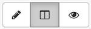

### CodiMD

#### General Usage

The Carpentries also offers [CodiMD](https://codimd.carpentries.org/) as another collaborative note taking platform. CodiMD recognises [Markdown](https://www.markdownguide.org/cheat-sheet/) syntax,
allowing users to utilise simple markup to format the content they add to the shared document.

The CodiMD interface provides three modes:

* _Edit_: an editor-only interface, which fills the browser window with a space for writing text.
* _Both_: a half-and-half interface, filling the left half of the window with the editor interface,
  and the right half with the (uneditable) viewing interface.
* _View_: a read-only, formatted interface,
  which fills the browser window with the rendered version of the notes entered in the Edit view.
  Any Markdown markup used in the Edit view will be applied in the View interface,
  appearing as formatted text (headings, bold, italics, links, etc) and images.

These modes can be selected with buttons to the top-left of the interface.

A new CodiMD document can be created by appending a descriptive name to the url `https://codimd.carpentries.org/`,
such as `https://codimd.carpentries.org/committeename`,
or by visiting <https://codimd.carpentries.org/> and clicking the "+ New guest note" button.

Documents are synchronised as you type, so that everyone viewing this page sees the same text.
This allows everyone to collaborate on documents.
Contributions from different users are underlined in different colours.
Hovering the cursor over content will display the name (or guest identifier) of the person who wrote it,
and the current location of different users' cursors is also displayed in Edit mode.

See <https://codimd.carpentries.org/features> for a full list of features available on CodiMD.

Use of this service is restricted to members of The Carpentries community;
this is not for general purpose use (for that, try [HackMD](https://hackmd.io/)).

Users are expected to follow our [code of conduct]( https://docs.carpentries.org/topic_folders/policies/code-of-conduct.html).
All content is publicly available under the [Creative Commons Attribution License](https://creativecommons.org/licenses/by/4.0/).

#### Document Access Levels & Accounts

Account creation and login is not required to create and edit CodiMD documents.

To register an account on the platform:

1. [Visit the platform homepage](https://codimd.carpentries.org/) and
   click the "Sign In" button near the top-right of the browser window.
2. When the pop-up appears, prompting the user to enter an email address and password,
   type in the email address and password you want to use for your account.
3. Click the "Register" button.

Account holders gain access to two features:

1. Ability to restrict access to documents the user owns:
   in View mode the person who created a document can select from several options
   to control who else is able to view and edit its content.
   Look for a dropdown menu with blue icon and text
   near top-left of a document's content to find these options.
   Some of these access levels also allow editing and viewing rights
   only to registered account holders.
2. A history of documents created and visited by the user,
   accessible via the History tab of the <https://codimd.carpentries.org/> landing page.
   The documents listed in this history can be searched, sorted, filtered,
   and organised into folders.

#### Troubleshooting

If you encounter issues with the CodiMD platform,
please contact us at team@carpentries.org and a team member will help you troubleshoot.

#### See Also

[Etherpad](https://docs.carpentries.org/topic_folders/communications/tools/etherpads.html) is another collaborative note taking platform used by the community members.
