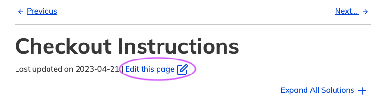
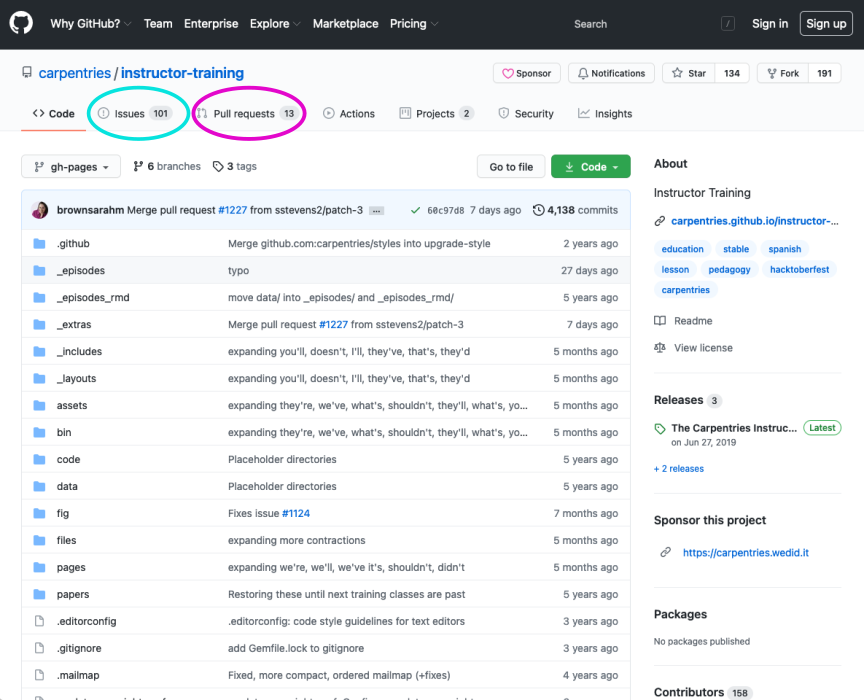
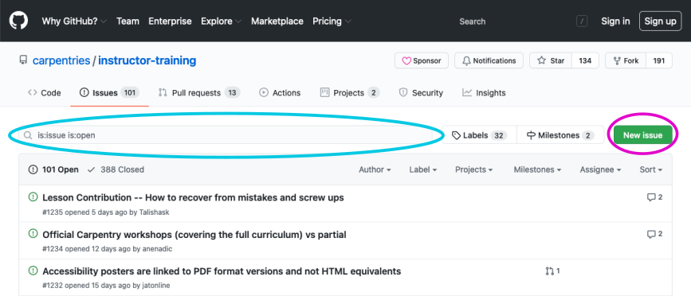
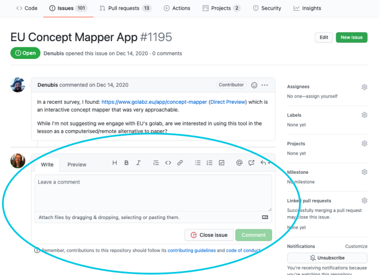

# How to Contribute to Carpentries Lessons

All Carpentries lessons are hosted on GitHub.

This gives you access to a 'back room' where the code for the curriculum website is freely available, suggestions for changes can be proposed, and conversations about potential changes can be held.

To get there, click on the link that says "Edit this page" near the page title, or "Edit on GitHub" in the footer at the bottom of the page.

Alternatively, you can find links to the GitHub repositories for each lesson in the tables on the “Lessons” page for each of The Carpentries Lesson Programs:  [Data Carpentry](https://datacarpentry.org/lessons/), [Library Carpentry](https://librarycarpentry.org/lessons/), and [Software Carpentry](https://software-carpentry.org/lessons/).

Links in the _Repository_ column of these tables will take you to the source repository for the relevant lesson. There are two tabs on this page that offer opportunities for interaction with the community that maintains the lesson.

The first is the "Issues" tab. When someone has an idea or suggestion, they can start a conversation about their idea by creating an Issue. Others can then comment on the Issue to provide feedback. Issues can be searched, using the search bar at the top.

"

If you have an idea, it is a good idea to search first to see if anyone else has already suggested it! If so, you can add your thoughts as a comment on the existing issue instead of starting a new one. (Either way, you can submit a link to the conversation with your contribution for [the _Get Involved_ step of Instructor Training checkout](https://carpentries.github.io/instructor-training/checkout.html#getinvolved).) Note that you must be signed in to GitHub to be able to see the comment box at the bottom of each issue.

If you find something that you know how to fix by changing the code of the lesson, you may instead wish to submit a Pull Request (PR). You can also review and comment on existing PRs. To learn how to submit a PR, consult this [community-contributed guide][github-guide].

Each lesson repository has a document, named `CONTRIBUTING.md`, that gives information on how to contribute to that lesson. ([Example: the guidelines for the Instructor Training curriculum repository][contributing].) Maintainers for each repository may choose to customize their own guidelines.

The Carpentries Slack workspace hosts a channel for people contributing for the first time, called `#first-time-contributors`. This is a great place to introduce yourself, ask questions, and share your accomplishments as you learn to contribute to our open source projects.

## Alternatives to GitHub

Learning to interact on GitHub can have many benefits, including the ability to contribute to other open-source projects! However, we understand that there are many reasons why trainees may wish to avoid engaging on GitHub. That's ok!

If you do not use GitHub, you may submit your contribution via [this form](https://docs.google.com/forms/d/e/1FAIpQLSeMBOj5Rdh8Mgk0ebRbeRyHhGHKbItdft6avWuEzmeg8CgWbA/viewform). A Carpentries Core Team member will create an issue based on the relevant repository, and will send you a link so that you may view any responses.

## Help Wanted: Breaking Down Barriers

At The Carpentries, we know that tools and technical procedures can present a serious barrier to progress.  That is why we exist! So we appreciate the irony when participation in our community demands tools or technical procedures that may not be familiar or accessible to all who wish to contribute. GitHub, in particular is often recognized as an obstacle; this is something our community has [discussed extensively][git-blog].

We are actively invested in making our processes as friendly and inclusive as possible, and that includes supporting our community in surmounting the barriers presented by our own technologies of choice. Watch our channels for opportunities to develop your skills as a contributor! In the meantime, if you have any ideas about how we can make our resources more contributor-friendly, please [let us know][contact-page].

### Adding or Subtracting
When considering a lesson contribution, keep in mind that most of our core lessons are already full to bursting with great content! In many cases, suggestions for how to cut or streamline may be more useful than a proposal for additional content or exercises. If you would like to propose new content, consider directing your contribution to [Glosario](https://github.com/carpentries/glosario/) or a lesson under active development in [The Carpentries Incubator](https://carpentries.org/community-lessons/).

### What Comes Next?
After you submit your contribution, the Maintainers or others may have follow-up questions or requests, so please be alert for notifications from GitHub. By default, GitHub will notify you about any further activity on conversations you have participated in or instigated. Because lesson Maintainers, like Instructors, are mostly volunteers, it may take them some time to respond! Some repositories have slower response times than others. Do not take it personally if your contribution does not get a prompt response. (Your contribution does not need to be reviewed or accepted in order to satisfy the _Get Involved_ step of Instructor Training checkout.)

## Making your contribution count towards Instructor certification

If you would like your contribution to count towards the _Get Involved_ requirement of [Instructor Training checkout][it-checkout], **you must submit it via AMY**. This is true even if you attend an event where attendance is taken.

For this checkout task, please:
1. log in to your [AMY profile][handbook-amy]. If you are unable to login to AMY, please see below.
2. Once you have logged in, select "Training progress" at the top of the screen.
3. Select the checkbox that best describes your step to Get Involved with The Carpentries.
3. Enter the requested information.
4. Your contribution should be evaluated in 7-10 days. We suggest checking back to ensure that your contribution was accepted.

If you have difficulty logging in to AMY, please:
1. Verify that you have completed the [Instructor Training application form][application], and that you have included a GitHub username in your application. Both the form and the GitHub username are necessary for us to create a profile that you can login to use.
2. Email us at [instructor.training@carpentries.org](mailto:instructor.training@carpentries.org). In this email, let us know when you have completed the application, and share your GitHub username if you did not previously include it. You may also share your selection for the _Get Involved_ step so that a member of our Core Team can enter it for you.

### Eligible Repositories

The only eligibility rule for contributions is that they must be made to a repository that is managed by The Carpentries.
That includes (but is not limited to):

- any [Data Carpentry](https://datacarpentry.org/lessons/), [Library Carpentry](https://librarycarpentry.org/lessons/), or [Software Carpentry](https://software-carpentry.org/lessons/) lesson
- The Carpentries [Instructor Training curriculum][it-curriculum] and [Collaborative Lesson Development Training curriculum][cldt-curriculum]
- any [community developed lesson][carpentries-incubator] in The Carpentries Incubator
- our open source, multilingual glossary of data science terms, [Glosario][glosario-github]

Repositories that are **not** eligible for contribution credit include forks of Carpentries repositories and other Carpentries-based content that is not located in a Carpentries repository. This is because The Carpentries Code of Conduct does not apply outside of Carpentries spaces. If you submit a link to an ineligible repository for this step, we may contact you with a request to redirect your contribution.

[application]: https://amy.carpentries.org/forms/request_training/
[help-wanted]: https://carpentries.org/help-wanted-issues/
[github-guide]: https://github.com/carpentries-incubator/swc_github_flow/blob/master/for_novice_contributors.md
[contributing]: https://github.com/carpentries/instructor-training/blob/main/CONTRIBUTING.md
[handbook-amy]: https://carpentries.github.io/amy/users_guide/community_index/
[git-blog]: https://carpentries.org/blog/2020/05/conversations-teaching-git-github/
[contact-page]: https://carpentries.org/contact/
[carpentries-incubator]: https://github.com/carpentries-incubator/
[glosario-github]: https://github.com/carpentries/glosario/
[discussion]: https://pad.carpentries.org/community-sessions-2023
[welcome]: https://pad.carpentries.org/welcome-sessions-2023
[pad-of-pads]: https://pad.carpentries.org/pad-of-pads
[demos-rubric]: https://carpentries.github.io/instructor-training/demos_rubric
[r-gapminder]: https://swcarpentry.github.io/r-novice-gapminder/
[start-points]: https://carpentries.github.io/instructor-training/demo_lessons
[slack]: https://slack-invite.carpentries.org/
[r-gapminder-episode]: https://swcarpentry.github.io/r-novice-gapminder/04-data-structures-part1
[trainee-profile]: https://amy.carpentries.org/workshops/trainee-dashboard/
[instructors-page]: https://carpentries.org/instructors/
[community-calendar]: https://carpentries.org/community/#community-events
[it-curriculum]: https://carpentries.github.io/instructor-training/
[cldt-curriculum]: https://carpentries.github.io/lesson-development-training/

