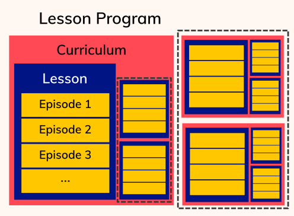

# Curriculum Structure

The Carpentries contains multiple _Lesson Programs_ (Data Carpentry, Library Carpentry, Software Carpentry). Each _Lesson Program_ contains at least one _curriculum_. A curriculum is composed of one or more _lessons_.
Lessons are built from a series of _episodes_.

More detailed definitions of these terms are available in [the community glossary](https://github.com/carpentries/community-development/blob/main/glossary.md).

The table below provides some examples of lessons and episodes that exist within each of our lesson programs. 

| Lesson Program | Curriculum | Lesson | Episode |
| :---- | :---- | :---- | :---- |
| Data Carpentry | Ecology | Data Organization in Spreadsheets for Ecologists | Exporting data |
|  | Genomics | Data Wrangling and Processing for Genomics | Assessing Read Quality |
| Library Carpentry | N/A | Open Refine | Faceting and filtering |
|  | N/A | The Unix Shell | Automating the tedious with loops |
| Software Carpentry | N/A | Plotting and Programming in Python | Writing Functions |
|  | N/A | R para Análisis Científicos Reproducibles | Guardando datos |
