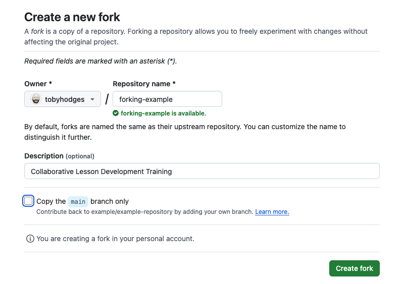

# Building on somebody else's existing branch
Sometimes, you may want or need to build on top of the changes another person has already commited to a branch of a lesson repository, e.g. [if they are no longer able to complete the work and you want to help finish their pull request](/handbooks/maintainers.md#situation-1-a-pull-request-exists-but-is-incomplete).
This page describes two ways you can get set up to build on top of the changes they have already made.
The instructions assume some familiarity with version control, Git, and GitHub.

## 1. Fork their repository and branch
### Find the original contributor's fork
Starting from the open pull request that you want to continue working on, scroll to the top of the _Conversation_ tab.
Under the title of the pull request, you will find a summary of the branches that would be combined if the pull request was merged: usually the lesson program organisation and `main` on the left, and the original contributor's username and the branch name they chose on the right (the "feature branch").

Clicking on the name of the contributor's feature branch will direct you to that branch on their fork of the lesson repository. 

### Make your own fork from theirs
From this page, you can create your own fork of their repository with the "Fork" button near the top-right of the page. 
This will open a short form, where you can set a name and a description for the new fork you will create.
The important thing to do here is **uncheck the "Copy the main branch only" box** so that you also get a copy of the feature branch they were working on for the pull request.

### Edit the lesson on GitHub
After your fork has been created, use the dropdown near the top-left of the repository homepage to choose the branch that the original contributor was working on. 
Once this branch is selected, you can start editing the files on GitHub being careful to commit your changes to this same branch.
Alternatively, you can [open the github.dev IDE in your browser](https://docs.github.com/en/codespaces/the-githubdev-web-based-editor#opening-the-githubdev-editor), select the branch and continue editing and commiting there.

### Edit the lesson locally
Follow these steps after your fork has been created.

1. Clone it to your local system.
2. In the shell, navigate to your local clone of the project, e.g. `cd ~/Documents/DataCarpentry/R-ecology-lesson`.
3. Fetch the branch that the original contributor was working on (`git fetch origin <their-branch-name>`, e.g. `git fetch origin 123-better-captions`)
4. Switch to it (`git switch <their-branch-name>`, e.g. `git switch 123-better-captions`).

Once you are working on this branch, you can edit the lesson and commit your changes as usual. 
When you are ready, add your own fork of the lesson repository as a remote (`git remote add <remote-name> <address-of-forked-repository-you-just-copied>`, e.g. `git remote add myfork git@github.com:myusername/image-processing.git`) push the commits you have made and open a pull request to the official repository.

## 2. Add their fork as a remote repository
If you already have a local clone of the lesson repository, you can add the original contributor's fork of the lesson as another remote repository for the project and fetch the branch they were working on from there.

1. Follow the steps described in [_Find the original contributor's fork_](#1-fork-their-repository-and-branch) above.
2. Click the _Code_ button and copy the address of this repository to your clipboard.
3. In the shell, navigate to your local clone of the project, e.g. `cd ~/Documents/DataCarpentry/R-ecology-lesson`.
4. Add the original contributor's fork as a new remote repository for this clone: `git remote add <remote-name> <address-of-forked-repository-you-just-copied>`, 
   e.g. `git remote add toby git@github.com:tobyhodges/image-processing.git`.
5. Fetch the branch they were working on from their fork, e.g. `git fetch toby 123-better-captions`.
6. Switch to this branch, e.g. `git switch 123-better-captions`.

Once you are working on this branch, you can edit the lesson and commit your changes as usual then push them to your fork and open a pull request when you are ready.

## Opening a pull request with your updates
When you are ready to open a new pull request that will include your changes, make sure that you do this to the correct repository (usually a repository in one of The Carpentries official organisations e.g. `datacarpentry`): GitHub may first try to help you open a pull request to the original contributor's fork instead of the central Carpentries repository.

When opening your pull request, tell the Maintainers that you have built on top of the previous work of the other contributor. Tag that original contributor, and reference their pull request by its number, e.g. `This pull request builds on and replaces #37 by @USERNAME to close issue #34 by [some description of the changes made in your pull request...]`.
This will help the lesson Maintainers understand that they can close the other pull request, and the relationship between the two sets of changes.
