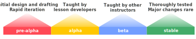
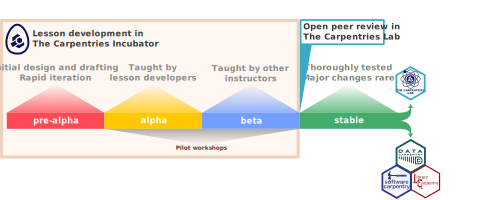

# The Life Cycle of Lessons
**A note about _Instructors_ and _instructors_:** in most of this handbook we refer to Instructors, capitalised to indicate that this is a certified role within the community i.e. somebody who has completed Carpentries Instructor Training. 
Some of our handbook content about curriculum development makes reference to instructors (without capitalisation), to distinguish between those who teach a workshop but may not yet be certified Instructors.

The Carpentries community develops lessons as Open Source projects: lessons and their source files are typically available online from the earliest stages of development onwards.
It can be helpful for visitors to a lesson -- instructors considering teaching it, potential contributors exploring its contents, etc -- and its developers themselves, to be able to quickly identify the development status of a lesson. 
Lesson development is an iterative process, with content and design always subject to evolution and improvement. 
For example, as feedback is received when a new lesson is taught, or in response to new features and other shifts in its subject matter. 
Over time, content typically becomes more complete, accurate, impactful, and stable, with changes -- especially major modifications such as reorganisation, or the addition/removal of whole sections -- becoming less frequent.

The Carpentries labels the development status of lessons in a similar system to that used in software development: we categorise them according to their maturity/stability, ranging from _pre-alpha_ to _stable_.

* **_Pre-alpha:_** the lesson is in the initial stages of design and development. 
  The content of lessons in pre-alpha is likely to be incomplete and untested, and may undergo major changes at any time. This label is typically applied to a lesson until a first draft has been completed.
* **_Alpha:_** the lesson is being piloted by its developers.
  The content of lessons in alpha is likely to have been fully drafted, but some gaps, inconsistencies, and errors can be expected.
  This label is typically applied to a lesson after its first draft has been completed, and before the first pilot workshops take place.
* **_Beta:_** the lesson is ready to be piloted by other instructors.
  The content of lessons in beta has been tested by (at least) its developers, and content has been adjusted based on that experience. 
  The content includes guidance for instructors on how to teach it effectively.
  Further changes are likely, as feedback is incorporated from additional pilot workshops.
  This label is typically applied to a lesson when its developers are confident that it is ready to be used in workshops by other instructors.
* **_Stable:_**: the lesson has undergone extensive testing and major changes are not expected (without significant warning).
  The content of stable lessons will still change from time to time, but the changes are usually small and do not heavily impact an instructor’s ability to teach it if they are familiar with an earlier (stable) version.
  This label is typically applied to a lesson after feedback from beta pilot workshops has been incorporated.

The life cycle stage of a lesson is prominently displayed at the top of the page on lesson websites.
It is also visible as a 'topic' on the GitHub repository of the lesson, beneath the _About_ box on the right-hand side of the repository homepage.

## How is the life cycle stage set?
The life cycle status of a lesson can be adjusted by modifying the `life_cycle` parameter in the lesson's `config.yaml` file, as well as the equivalent topic on the source GitHub repository.

## Who is responsible for choosing the life cycle stage of a lesson?
For community-owned lessons in The Carpentries Incubator, lesson developers are free to choose whichever label they feel is appropriate. 
Community-owned lessons in The Carpentries Lab have passed peer review and should be marked stable. 
The life cycle stage of lessons belonging to a Carpentries lesson program should be changed following consultation with the relevant Curriculum Advisory Committee and/or the Curriculum Team. 
Consultation is especially important before marking a lesson as beta or stable.

## What happens at each stage of the life cycle?
[Pilot workshops](lesson-pilots.md) are probably the most important events that take place before a lesson reaches stability. 
However, here are some other actions that lesson developers can take at different stages:

* **Pre-alpha:**
  * [Submit the lesson to The Carpentries Incubator](https://github.com/carpentries-incubator/proposals/)
  * Join [Collaborative Lesson Development Training](https://carpentries.org/lesson-development-training)
  * Call for collaborators
  * If you intend the new lesson to join an existing Carpentries curriculum or lesson program, consult the relevant [Curriculum Advisory Committee](https://carpentries.org/curriculum-advisors/) or [Lesson Program Governance Committee](https://carpentries.org/lesson-program-governance/) as early as possible.
	These community governance groups can provide feedback on your plans and offer guidance on how to ensure successful integration of the new lesson.
* **Alpha:**
  * Run [alpha pilot workshops](lesson-pilots.md#alpha-and-beta-pilots) and iterate on the design and content of the lesson.
  * Raise awareness of the lesson in The Carpentries community
* **Beta:**
  * Find instructors who can teach the lesson in [beta pilot workshops](lesson-pilots.md#alpha-and-beta-pilots), and gather feedback from them to improve the lesson further. 
    Consider inviting those [beta pilot instructors](./lesson-development-roles.md#beta-pilot-instructors) to join the team developing/maintaining the lesson.
  * [Publish the lesson to Zenodo and obtain a DOI](./lesson-release.md)
  * [Submit the lesson for peer review in The Carpentries Lab](https://github.com/carpentries-lab/reviews/)
* **Stable:**
  * [Release the stable version to Zenodo](./lesson-release.md)
	  * You might like to repeat this process regularly e.g. make annual releases.

