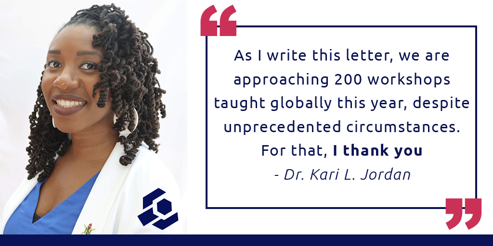

# Donation Request Resources

## Introduction
The following resources were created to aid The Carpentries community in fundraising for the organisation. 

## Donation Request Letter - Individual
Email Subject Line: A Call to Action: Help The Carpentries Meet Our Fundraising Goal

Dear [potential donor’s name],

My name is [your name], and I am a [position or role] with The Carpentries. Our vision is to be the leading inclusive community teaching data and coding skills.

The importance of digital skills is undeniable; educators and organisations are collaborating to support effective instructional strategies, and with your help, The Carpentries is primed to thrive in this environment. Our instructors run weekly workshops worldwide to teach our established digital skills curricula, but our work is never finished, and we want to do much more.

The Carpentries supports more than 4,200 highly skilled instructors in communities in 65 countries worldwide. We have experience training educators, researchers, librarians, and technologists. We have scaled our instructor training and curriculum development programs to respond to the shifts in education worldwide. __Now more than ever, we need you to champion our mission__. You can help us teach data skills to the communities that need them most by donating any amount you feel comfortable with.

__Our goal is to raise $5,000 in individual contributions quarterly. Will you help us get there?__

Donating even a small amount can make a big difference - we value all contributions. Your donation will allow The Carpentries to expand into new geographies and disciplines and help bring workshops to individuals who might otherwise have barriers to participation.

If you want to support The Carpentries’ mission of teaching data skills globally, [please visit our giving page](https://give.communityin.org/TheCarpentries) and donate any amount you are comfortable with.
Thank you so much!

Sincerely,  
[Your name]  
[Your role within The Carpentries]

## Donation Request Letter - Organisation
Hello [potential donor’s name],

I am writing to thank you for [previous interaction or partnership]. By partnering with us on [previous interaction], The Carpentries was able to [positive result or impact]. I am writing to inform you of another  opportunity for [their organisation] to partner with The Carpentries.

The importance of digital skills is undeniable; educators and organisations are collaborating to support effective instructional strategies, and with your help, The Carpentries is primed to thrive in this environment. Our instructors run weekly workshops worldwide to teach our established digital skills curricula, but our work is never finished, and we want to do much more.

The Carpentries supports more than 4,200 highly skilled instructors in communities in 65 countries worldwide. We have experience training educators, researchers, librarians, and technologists. We have scaled our instructor training and curriculum development programs to respond to the shifts in education worldwide. __More than ever, we need organisations like [ organisation ] to champion our mission__. With your help, we can teach data skills to the communities that need them most. We invite [ organisation ] to donate any amount you feel comfortable with.

Your organisation’s donation will allow The Carpentries to expand into new geographies and disciplines and help bring workshops to individuals who might otherwise have barriers to participation.

If you are interested in partnering with us with a donation or have any questions, please reply directly to this email. I am also available to discuss our fundraising goals via phone or Zoom call.

Thank you so much!

Sincerely,  
[Your name]  
[Your role within The Carpentries]

## Short Calls to Action/Mastadon Length Messages
- A Call To Action: Support The Carpentries  
Consider donating to The Carpentries to help us reach our annual fundraising goal!   <https://give.communityin.org/TheCarpentries>

- “The Carpentries supports more than 4,200 highly skilled instructors in communities in 65 countries. Now more than ever, we need you to champion our mission.” - Dr. Kari L. Jordan  
Help us teach data skills to the communities that need them most. 
<https://give.communityin.org/TheCarpentries>

- Thank you to everyone who has donated to help The Carpentries achieve our mission! With your help, we are on track to reach our goal. Please consider donating to help us achieve our annual fundraising goal. 
<[https://give.communityin.org/81tdn9?ref=sh_fAVdid_ab_1xKrq5WDcOB1xKrq5WDcOB](https://give.communityin.org/TheCarpentries)>

## Appeal Images
### Fundraising Letter Pull Quote

### Fundraising Video Title Card

